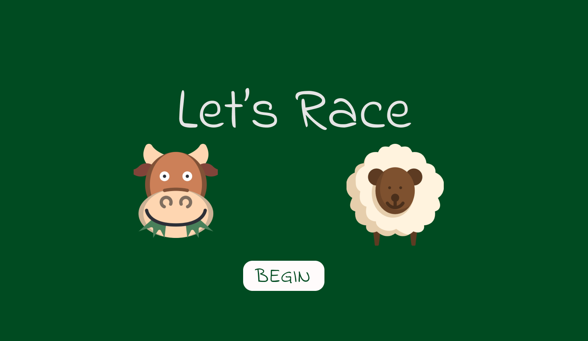
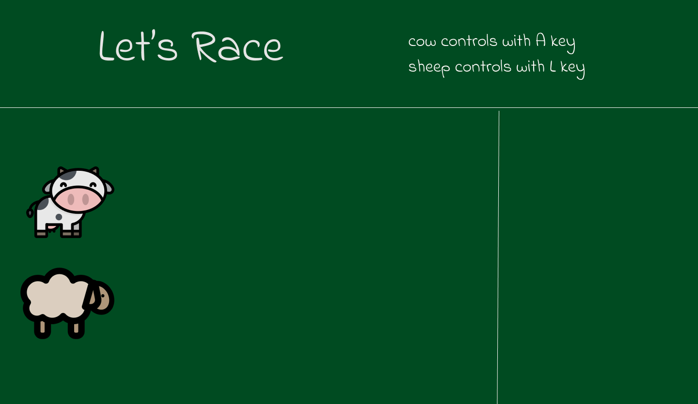

# Let's Race

## Index:

- [Basic Idea](#Basic-Idea)
- [User Stories](#user-stories)
- [Wireframes](#wireframes)

## Basic Idea 
This is a game about two animal that race with eachother. We have two player that each of them controling one of the animals. The one that reach to finish line first that is going to be the winner   

## User Stories
In our game we have two users(players) that controlling their animal for race with keyboard keyes.

* The users are in start page.
* press the the Begin button.
* Players can see a farm with cow, sheep.
* Player1 can play with A key from keyboard.
* player2 can play with L key from keyboard.
* The players need to continusly press their controling button to win .
* The one that press more and reach finish line first is the winner .
## Wireframes
The begging page. 

The game view. 

When game is over so we have this view if cow won the game. 

